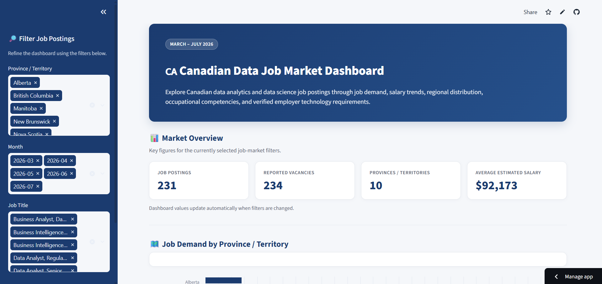

# Canadian Job Market Analysis

## Overview

This project analyzes real Canadian job posting data to explore the demand for data analytics and data science roles across Canada.

The analysis focuses on job posting volume, geographic demand, salary patterns, occupational skills, and employer technology requirements. The final results are presented through an interactive Streamlit dashboard.

The goal of this project is to provide an evidence-based view of what the Canadian data job market expects from candidates instead of relying only on general career advice.

---


## Live Dashboard

[View the Interactive Dashboard](https://canada-job-market-analysis.streamlit.app/)

---

## Dashboard Preview




---

## Objective

The main objectives of this project are to:

- Collect and analyze Canadian job posting data for data-related careers.
- Identify which provinces have the highest demand for data professionals.
- Analyze salary patterns across job titles and regions.
- Study important occupational skills for data-related careers.
- Identify technologies and programming tools mentioned in verified Job Bank postings.
- Store and query cleaned data using SQLite and SQL.
- Present the findings through an interactive Streamlit dashboard.

---

## Data Sources

### Government of Canada Job Bank

Monthly Job Bank open-data files from the following five months were used:

- March 2026
- April 2026
- May 2026
- June 2026
- July 2026

These datasets were used to study:

- Job posting volume
- Province and city information
- Job titles
- Salary information
- Reported vacancies
- NOC 2021 classifications

> **Note:** The original monthly Job Bank CSV files are not stored in this repository because of their large combined file size. They can be downloaded from the Government of Canada Open Data portal. The processed datasets used for the analysis and dashboard are included in this repository.

### Government of Canada OaSIS

Government of Canada OaSIS occupational data was linked to Job Bank postings using NOC 2021 codes.

This dataset was used to study occupational competencies such as:

- Problem Solving
- Digital Literacy
- Critical Thinking
- Systems Analysis
- Numeracy
- Decision Making
- Reading Comprehension
- Writing
- Troubleshooting
- Time Management

---

## Technologies Used

The project was developed using:

- Python
- pandas
- SQLite
- SQL
- Streamlit
- Git
- GitHub
- Jupyter Notebook

---

## Project Workflow

### 1. Data Collection

Five months of Government of Canada Job Bank open-data files were collected, covering March through July 2026.

The monthly datasets were combined so that job market patterns could be studied across several months instead of using data from only one period.

### 2. Data Cleaning

The datasets were filtered for data-related roles, including:

- Data Scientist
- Data Analyst
- Business Data Analyst
- Business Intelligence roles
- Data Analytics Specialist
- Data Quality Analyst

Missing values were reviewed, date formats were standardized, and useful columns were selected for further analysis.

After cleaning and salary validation, the main analysis contained **231 job postings**.

### 3. Salary Standardization

Salary information in the original data was provided using different payment periods, including hourly, yearly, and bi-weekly salaries.

To make the salary values comparable:

- Hourly salaries were converted using 40 hours per week × 52 weeks per year.
- Bi-weekly salaries were converted using 26 pay periods per year.
- Yearly salaries were kept as annual values.

Clearly malformed salary records were excluded from the salary analysis.

This allowed salaries from different job postings to be compared using estimated annual values.

### 4. SQLite and SQL Analysis

The cleaned datasets were stored in a SQLite database.

The database contains tables for:

- Job postings
- Occupational skill profiles
- Skill summaries
- Technology demand
- Technology mentions

SQL queries were used to analyze:

- Job postings by province
- Job postings by month
- Most common job titles
- Average salary by job title
- Average salary by province
- Occupational skill rankings
- Technology demand

### 5. Occupational Skills Analysis

OaSIS occupational profiles were matched to Job Bank postings through NOC 2021 codes.

The strongest posting-weighted occupational skills found in the analysis were:

- Problem Solving: 4.83 / 5
- Digital Literacy: 4.67 / 5
- Critical Thinking: 4.67 / 5
- Systems Analysis: 4.67 / 5
- Numeracy: 4.42 / 5

This part of the project provides a broader view of the abilities that are important across data-related occupations.

### 6. Technology Demand Analysis

The monthly Job Bank open-data CSV files do not contain complete job requirement text. Because of this limitation, technologies such as Python, SQL, AWS, and C++ could not be directly extracted from every posting in the main dataset.

To address this problem, direct Job Bank postings were identified and matched with available Job Bank information. Technology requirements were successfully verified for a smaller sample of these postings.

The final technology analysis used **19 verified direct Job Bank postings**.

A total of **77 technology mentions** covering **41 unique technologies and technology categories** were identified.

Technologies found in the verified sample included:

- Python
- SQL
- MySQL
- AWS
- C++
- Java
- Linux
- Machine Learning
- Data Warehouse
- Database Software
- Programming Software
- Spreadsheet Software
- Data Analysis Software

Technology demand percentages are calculated only from the verified direct Job Bank sample. Therefore, these percentages should not be interpreted as representing all 231 postings in the complete dataset.

### 7. Dashboard Development

An interactive dashboard was developed using Streamlit.

The dashboard presents information about:

- Total job postings
- Reported vacancies
- Job demand by province
- Monthly job posting trends
- Most common job titles
- Salary by job title
- Salary by province
- Occupational skills
- Technology demand
- Individual job posting data

The dashboard also includes filters that allow users to explore the data by province, month, and job title.

---

## Key Findings

### 1. Ontario Had the Highest Job Demand

Ontario accounted for **131 of the 231 salary-valid job postings** analyzed, making it the province with the highest number of data-related job postings in the dataset.

### 2. Data Scientist Was the Most Common Job Title

There were **96 Data Scientist postings**, making it the most common job title in the dataset.

This was followed by **68 Data Analyst - Informatics and Systems postings**.

### 3. Data Scientist Salaries Were Relatively High

Data Scientist postings had an estimated average annual salary of approximately **$102,762**.

Lead Data Scientist roles had the highest average salary among job titles represented by at least two postings, at approximately **$137,800**.

### 4. Problem Solving Was the Strongest Occupational Competency

Problem Solving had the highest posting-weighted OaSIS rating at approximately **4.83 out of 5**.

Digital Literacy, Critical Thinking, and Systems Analysis each had an average rating of approximately **4.67 out of 5**.

These results show that data-related careers require more than technical knowledge. Strong analytical and problem-solving abilities are also important.

### 5. Python Appeared Frequently in the Verified Technology Sample

Python appeared in **4 of the 19 verified direct Job Bank postings**, representing approximately **21.05%** of the verified technology sample.

SQL appeared in 3 postings, while technologies and tools such as MySQL, AWS, C++, Java, Linux, and Machine Learning were also identified.

Because this analysis is based on a smaller verified sample, these results should be treated as an indicator of technology demand rather than a complete measurement of the Canadian data job market.

---

## Project Structure

```text
CA JOB Market/
│
├── dashboard/
│   └── app.py
│
├── data/
│   ├── raw/
│   │   └── OaSIS Skills/
│   │       └── skills_oasis_2025_v1.1.csv
│   │
│   └── processed/
│       ├── canada_data_jobs_clean.csv
│       ├── direct_job_bank_postings.csv
│       ├── final_unchecked_technology_jobs.csv
│       ├── job_market.db
│       ├── jobs_with_skills.csv
│       ├── noc_skill_profiles.csv
│       ├── remaining_technology_jobs.csv
│       ├── skill_summary.csv
│       ├── technology_collection.csv
│       ├── technology_demand.csv
│       ├── technology_mentions.csv
│       └── verified_technology_jobs.csv
│
├── notebooks/
│   └── 01_data_exploration.ipynb
│
├── src/
│   ├── database.py
│   ├── sql_analysis.py
│   └── test_setup.py
│
├── .gitignore
├── requirements.txt
└── README.md
```

The five original monthly Job Bank CSV files are stored locally for analysis but are excluded from the GitHub repository because of their large file sizes.

---

## Running the Project

### 1. Clone the Repository

Clone the project from GitHub and enter the project directory.

```bash
git clone https://github.com/DiwURTandon/Canada-Job-Market-Data-Analysis-.git
cd Canada-Job-Market-Data-Analysis-
```

### 2. Install the Required Packages

Install the Python packages listed in `requirements.txt`.

```bash
pip install -r requirements.txt
```

### 3. Build the SQLite Database

Run:

```bash
python src/database.py
```

This loads the processed datasets into the SQLite database and creates the tables used by the project.

### 4. Run the SQL Analysis

Run:

```bash
python src/sql_analysis.py
```

This displays the main SQL analysis results, including job demand, salaries, occupational skills, and other job market information.

### 5. Launch the Streamlit Dashboard

Run:

```bash
python -m streamlit run dashboard/app.py
```

Streamlit will start the application and provide a local address that can be opened in a web browser.

---

## Limitations

This project has several limitations that should be considered when interpreting the results.

- The analysis covers March through July 2026 and represents a specific period of the Canadian job market.
- The dataset focuses on selected data-related job titles and does not represent every technology or data position in Canada.
- Technology-demand results are based on 19 verified direct Job Bank postings because the monthly open-data files do not contain complete technology requirement text.
- Some Job Bank postings could not provide usable technology information.
- OaSIS skill ratings represent occupation-level competencies rather than requirements written by individual employers.
- Salary values were standardized into estimated annual amounts, so they should be treated as estimates.
- Provincial salary averages based on very small numbers of postings should be interpreted carefully.

---

## Future Improvements

Possible future improvements to this project include:

- Adding more months of Job Bank data.
- Expanding the analysis to additional data and technology careers.
- Improving technology extraction if more detailed job requirement data becomes available.
- Comparing technology demand between provinces.
- Studying how technology demand changes over time.
- Adding more advanced visualizations and filters to the dashboard.
- Expanding the analysis as new Canadian job market data becomes available.

---

## Conclusion

This project provides a data-driven view of the Canadian job market for data analytics and data science careers.

By combining Job Bank posting data, OaSIS occupational information, SQL analysis, technology research, and an interactive Streamlit dashboard, the project shows both the technical and general skills connected to data-related careers in Canada.

The results suggest that programming and database technologies such as Python, SQL, and MySQL are useful in the field, while broader abilities such as problem solving, digital literacy, critical thinking, and systems analysis are also highly important.

The project also demonstrates a complete data analysis workflow, from collecting and cleaning raw data to storing, querying, analyzing, visualizing, and presenting the final results.